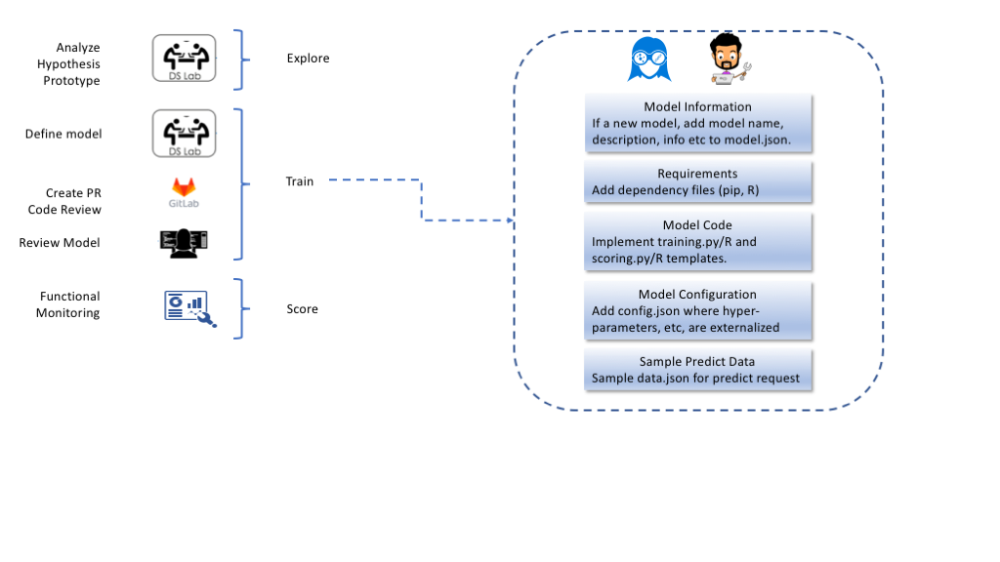

# Models

This repository contains demo models for the Teradata AOA.

The data science development perspective and process can be summarised by the following diagram

# Available Models

- [Tensorflow Sentitment Analysis](model_definitions/74eca506-e967-48f1-92ad-fb217b07e181/DOCKER/)
- [Python XGboost (Diabetes)](model_definitions/03c9a01f-bd46-4e7c-9a60-4282039094e6/DOCKER)
- [Vantage XGboost (Diabetes)](model_definitions/920ebf0e-1f0e-442a-94d1-214f63b8b820/DOCKER)
- [Demo R GBM (Diabetes)](model_definitions/bf6a52b2-b595-4358-ac4f-24fb41a85c45/DOCKER)

# Adding new Models

The models are all defined under the directory [model_definitions](./model_definitions). The directory structure is as follows:

    model_definitions/
        <model_id>/
            README.md
            model.json
            <aoa-trainer-framework>/
                config.json
                model_modules/
                    __init__.py
                    requirements.txt
                    scoring.py
                    training.py

The __init__.py must be defined in a specific way to import the training and scoring modules. This is important to support relative imports and shared code for a model.

    from .training import train
    from .scoring import evaluate
    
And if you want to deploy this behind a restful API add the ModelScorer abstraction for the REST engine

    from .scoring import ModelScorer
                
In the case of an R model, the model_modules folder is slightly different with

                model_modules/
                    requirements.R
                    scoring.R
                    training.R

Note that other files may be included under the model_modules folder and they will be added to the relevant containers during training, evaluation and scoring. Examples of this a common data prep classes etc.

## Python Model Signatures

The python train and evaluate functions are 

    def train(data_conf, model_conf, **kwargs):
       ...
       
    def evaluate(data_conf, model_conf, **kwargs):
       ...
       
If deploying behind a Restful scoring engine, the predict function is declared within a ModelScorer class
       
    class ModelScorer(object):
        ...
        
        def predict(self, data):
            ...

Note that the `**kwargs` is used to ensure future extendibility of the model management framework and ensuring that models are backward compatible. For instance, we may pass new features such as callback handlers that the frameworks supports to newer models, but the old models can safely ignore such parameters.

### Python Training Progress Callback

We have added an example of the training progress support in the AOA framework to the [Tensorflow Sentitment Analysis](model_definitions/74eca506-e967-48f1-92ad-fb217b07e181/DOCKER/model_modules/callback.py). This works by sending progress messages via activemq which can in take whatever action it needs to based on the progress, update a UI for example or trigger some alert if a progress is stalled. The provided `AoaKerasProgressCallback` function should be located in an AOA python module whenever this is created and simply imported instead of being defined in the sample model.

### Shared Code

To share common code between models, you should create a separate models util module that you can release and version. To share code between the training and scoring of an individual model, you can follow the example code in the [tensorflow sample](model_definitions/74eca506-e967-48f1-92ad-fb217b07e181/DOCKER/model_modules). There you can see that the [preprocess.py](model_definitions/74eca506-e967-48f1-92ad-fb217b07e181/DOCKER/model_modules/preprocess.py) file has code that is used in both training.py and scoring.py. 

## R Model Signatures

The R model signatures are exactly the same as the python signatures, with the `... being the equivalent of python `**kwargs`

    train <- function(data_conf, model_conf, ...) {
       ...
    }
    
    evaluate <- function(data_conf, model_conf, ...) {
       ...
    }
    
If deploying behind a Resful engine, the predict method should also be declared as follows

    predict.model <- function(model, data) {
    
    }

# Cli tools

To aid developing and testing the models setup in the AOA locally and in the datalab, we provide some useful cli tools to 
run the model training and evaluation using the config and data that you expect to be passed during automation.

Python
 - [run-model-cli.py](cli/run-model-cli.py)

R
 - TBC..
